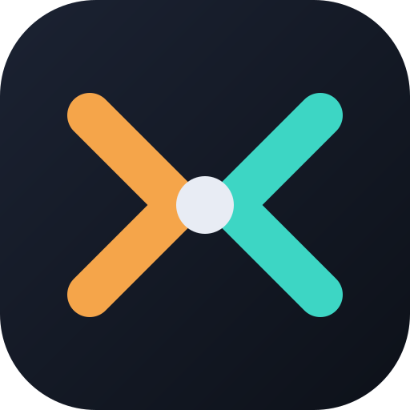

<p align="center"></p>

<h1 align="center">AgentHub</h1>

<p align="center">Keep coding when one AI agent runs out. Hand the baton from Claude Code to Codex, and back, without losing where you were.</p>

<p align="center"><a href="https://github.com/ChandraGovind19/AgentHub/releases">Download for macOS</a> · <a href="#quick-start">Quick start</a> · <a href="#how-it-works">How it works</a> · <a href="#cli-reference">CLI reference</a></p>

---

## What it is

AgentHub is a local-first tool for people who pay for both Claude Code and Codex and keep hitting the usage limit on one while the other sits idle. It runs the two native CLIs against one shared checkout, one at a time, and makes the switch between them a single click or a single command. The incoming agent starts with a real picture of what the outgoing one did, including when the outgoing one was cut off mid-task and could not write a summary.

It ships as a macOS desktop app and as a command-line tool. Everything runs on your machine. There is no account, no server, no telemetry, and the agents authenticate with their own subscriptions exactly as they do today.

## The problem it solves

You start a feature with Claude Code. Two hours later it says you have reached your limit. Codex is available, but it knows nothing about the last two hours: not the plan, not the half-finished refactor, not the failing test you were about to fix. So you either wait for the limit to reset or spend twenty minutes re-explaining.

AgentHub removes the re-explaining. When you switch, the next agent receives:

- **The previous agent's own session log.** Both CLIs write a full transcript to disk as they work. AgentHub reads it, extracts the last turns (your prompts, the agent's replies, every file it edited and command it ran) and hands them over. Nothing is asked of the agent that ran out.
- **The shared journal.** A plain Markdown file in the project that each agent is instructed to append to as it works, ending with a handoff entry when it can.
- **The diff.** Current `git status`, plus every commit and changed file since the previous session started.
- **The task**, if you are using AgentHub's lightweight task list.

## Quick start

### Desktop app

1. Download the `.dmg` for your Mac from the [Releases page](https://github.com/ChandraGovind19/AgentHub/releases): `arm64` for Apple Silicon, `x64` for Intel. Open it and drag AgentHub to Applications.
2. The builds are not signed with an Apple Developer certificate, so on first launch macOS says the developer cannot be verified. Right-click the app in Applications, choose **Open**, then **Open** again. You only do this once. The equivalent command is:

   ```bash
   xattr -dr com.apple.quarantine /Applications/AgentHub.app
   ```

3. Have [Claude Code](https://docs.claude.com/en/docs/claude-code) and/or [Codex](https://github.com/openai/codex) installed and signed in. AgentHub does not need Node.js or anything else; its runtime is bundled.
4. Press **⌘O** and pick a project folder. AgentHub creates a `.agenthub/` folder inside it for the journal and its metadata.
5. Press **Continue with Claude Code**. The agent opens in the terminal lane exactly as it would in your own terminal. Once it is ready, one line is typed into its input box for you, pointing at the handoff context. Press Enter when you want it to start.
6. Work as usual. When the agent runs out, press **Continue with Codex**. It opens with the recovered context of the previous session. Repeat in either direction as often as you like.

### Command line

```bash
git clone https://github.com/ChandraGovind19/AgentHub.git
cd AgentHub
npm install
npm test
npm link            # makes `agenthub` and `ahub` available everywhere
```

Then, inside any project:

```bash
agenthub init
agenthub work claude       # opens Claude Code; the handoff line is copied to your clipboard
# ... later, Claude Code runs out ...
agenthub work              # no agent named: swaps to the other one, with recovered context
```

`agenthub work --auto` submits the full context as the first message instead of leaving it for you to send. `agenthub work --dry-run` shows the plan and saves the context without launching.

## How it works

```
 Claude Code ──────┐                                     ┌────── Codex
   runs out        │  1. read its local session log      │  starts with:
                   │  2. read the shared journal         │   what happened,
                   │  3. git status + diff since start   │   what is next,
                   └──► .agenthub/handoffs/<time>-codex-work.md ──┘   what changed
```

**The briefing.** Before the raw conversation tail, the incoming agent gets a short state of play built from the same log: your last request, the files the previous agent edited, the last commands it ran, its last words, and whether it stopped because of a limit.

**Session recovery.** Claude Code keeps its transcripts under `~/.claude/projects/<project>/`, Codex under `~/.codex/sessions/<date>/`. AgentHub locates the file for the same working directory and time window as the session it recorded, and extracts the visible conversation in order. Hidden reasoning is never copied. Dashboard lanes additionally keep a cleaned copy of the terminal output as a fallback. If neither is available, the journal and the diff still carry the handoff.

**The journal.** `.agenthub/memory/journal.md` is shared by both agents. The launch context instructs each agent to append short entries as it works and a `## Handoff` entry when it senses its limit approaching. Because a handoff usually happens when the agent is already out of usage, the journal is a bonus, not a requirement: session recovery works without it.

**The launch line.** AgentHub never auto-runs a prompt unless you ask. In the app, once the agent's own interface has drawn and gone quiet, this single line is typed into its input box and left there for you:

```
Read .agenthub/handoffs/2026-09-15T10-41-22-codex-work.md and continue from where the previous session left off.
```

You can edit it, add to it, or press Enter as is. From the command line the same line is copied to your clipboard.

**Work sessions.** Each launch is recorded in `.agenthub/work.json` with the agent, task, time, and the commit it started from. That record is what makes "everything that changed since the previous session" precise, and what makes `agenthub work` know which agent is next.

## The dashboard

The app window is the AgentHub dashboard, a local web page served only on `127.0.0.1`. You can also open it in a browser with `agenthub dashboard`.

- **The board** at the top shows both agents, who worked last, who is up next, and the arrow between them. Each agent has its own button; the recommended one is filled in that agent's color, amber for Claude Code and teal for Codex.
- **Lanes** are two terminal tabs. Continue picks a free lane. Both can run at the same time if you want to keep one agent reviewing while the other builds.
- **Out of usage, detected for you.** When a running agent prints its own usage-limit message, the lane flips to "Out of usage" with the reset time, the board headline changes, the desktop app sends a notification, and the other agent's button is armed. Tick **Auto hand off when an agent hits its limit** and AgentHub starts the other agent in a free lane by itself; the instruction line still waits for your Enter.
- **Hand off** is optional. If the running agent still has budget, it asks it to write its journal entry now. If it is already out, skip it; recovery does not depend on it.
- **Stop** ends the session cleanly. **Reconnect** reattaches the display without disturbing the agent.
- **Shared journal** and **Recent sessions** sit under the lanes.
- **Project details** drawers hold everything else: quick actions, recommended commands, agent configuration, tasks, worktrees, session history, patch transfers, and saved reviews.

If a CLI is not installed, its button is disabled and the board shows the install command. **Check for Updates…** in the File menu compares your version with the latest GitHub release when you ask; the app never checks on its own.

The desktop app adds a projects sidebar (⌘1–9 to switch), native notifications when a session ends so you know it is time to hand off, ⌘R to reload, ⌘W to close a project, and ⌘⇧R to restart its dashboard. Sessions keep running while you switch projects.

## CLI reference

| Command | What it does |
|---|---|
| `agenthub init` | Create `.agenthub/` in the current project. |
| `agenthub work [claude\|codex] [--task id] [--auto] [--dry-run]` | Start or continue a session with recovered context. No agent named means "the other one". |
| `agenthub dashboard` (alias `ui`) | Serve the dashboard on `http://127.0.0.1:3737`. |
| `agenthub status` / `agenthub changes` | Project, task, lock, and git summary. |
| `agenthub task create <title>` / `list` / `update` / `assign` | A small task list the context can be focused on. |
| `agenthub complete <id> [--unlock]` | Mark a task done, optionally releasing its file locks. |
| `agenthub handoff <agent> [--copy]` | Generate a full handoff document without launching anything. |
| `agenthub ingest [file] [--extract]` | Import an agent's own summary into the project memory. |
| `agenthub review <agent> --save` | Save a review of an agent worktree's changes. |
| `agenthub attach <agent>` | Open a native CLI in your own terminal with no context injection. |
| `agenthub worktree create\|list\|status\|remove <agent>` | Isolated git worktrees for parallel work. |
| `agenthub switch <task> --from a --to b [--apply] [--include-untracked] [--continue]` | Move uncommitted changes between two agent worktrees as a patch. |
| `agenthub run\|continue <task> --agent <a>` | Non-interactive automation using the CLIs' headless modes. |
| `agenthub agents` / `agenthub config agent <a>` | Detect installed CLIs and set model, effort, or permission mode per agent. |
| `agenthub doctor` | Validate project state and report stale locks. |

Run any command with `--help` for its options.

## Beyond the swap

The swap workflow uses one shared checkout because that is what "continue where I left off" needs. For parallel work AgentHub also supports isolated **worktrees** per agent, **advisory file locks** so two agents do not edit the same file, **patch transfer** between worktrees with a dry-run preview, **automated run/continue** through the CLIs' headless modes with captured output and timeouts, and confirmed **dashboard actions** for sync, review, run, continue, switch, and complete. All of it is opt-in and documented in the CLI help.

## Privacy and safety

- The dashboard binds only to `127.0.0.1`, rejects requests from other hosts and origins, accepts actions only as POST with a per-server token and a one-use confirmation, and runs only a fixed list of AgentHub commands, never arbitrary shell input.
- The desktop app makes no network requests of its own. Its dashboard view is sandboxed and can only load local AgentHub pages.
- Agent credentials stay with the native CLIs. AgentHub never sees, stores, or asks for passwords, keys, or tokens.
- Session recovery reads local log files that already exist on your disk and copies excerpts into `.agenthub/handoffs/` inside your project. Review that folder before committing it, or add it to `.gitignore`.
- Writes to `.agenthub/` are atomic and serialized. A lock left behind by a crashed command is detected as stale and reclaimed automatically.

## Requirements

- macOS 12 or newer for the desktop app (Apple Silicon or Intel).
- For the CLI from source: Node.js 22 or newer and Git 2.17 or newer.
- Claude Code and/or Codex installed and signed in. Other agents are not supported yet.

## Developing

```bash
npm install          # also builds; node-pty is optional and prebuilt
npm test             # builds, then runs the test suite with real CLI subprocesses
npm run desktop:install   # one-time: fetches Electron into desktop/
npm run desktop           # run the app from source
npm run desktop:smoke     # headless end-to-end check of the packaged flow
npm run desktop:dist      # build .dmg and .zip for both architectures into desktop/dist
```

Layout: `src/core/` holds the coordination engine (`work.ts` for sessions and context, `transcripts.ts` for session-log recovery, `dashboard*.ts` for the local server, page, and terminal lanes), `src/index.ts` is the CLI, `desktop/` is the Electron shell, and `tests/` runs against the built `dist/`.

Releases are built by [`.github/workflows/release.yml`](.github/workflows/release.yml): push a tag like `v0.8.0` and it attaches the installers to a GitHub Release. If Apple signing secrets are ever added to the repository, the same workflow signs and notarizes automatically.

## Credits and license

AgentHub was created by Chandra Govindarajan. Released under the [MIT License](LICENSE). Issues and pull requests are welcome at [github.com/ChandraGovind19/AgentHub](https://github.com/ChandraGovind19/AgentHub).
